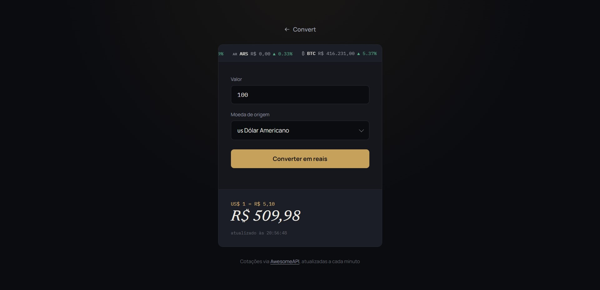

# Convert

Conversor de moedas com cotação em tempo real. Digita um valor, escolhe a moeda de origem e ele mostra quanto isso dá em reais, usando a cotação do momento — nada de valor fixo hardcoded no código.

Comecei esse projeto num desafio da Rocketseat (a base de layout é de lá) e fui evoluindo por conta: troquei a cotação manual por uma API de verdade, adicionei mais moedas e refiz o visual do zero.

 

## O que ele faz

- Busca a cotação de USD, EUR, GBP, JPY, ARS e BTC contra o Real via [AwesomeAPI](https://docs.awesomeapi.com.br/api-de-moedas)
- Atualiza a cotação sozinho a cada 60 segundos
- Ticker no topo do card mostrando a variação (%) de cada moeda no dia
- Se a API cair ou faltar internet, trava o formulário e avisa em vez de deixar converter com valor errado
- Mantém a moeda selecionada entre uma atualização e outra

## Stack

HTML, CSS e JavaScript puro. Sem framework, sem build step — só abrir o `index.html`.

Usei `Intl.NumberFormat` pra formatação de moeda e `fetch` nativo pra consumir a API. A única dependência externa são as fontes do Google Fonts (Manrope, Newsreader e IBM Plex Mono).

## Rodando local

Não precisa instalar nada. Só clonar e abrir o `index.html` no navegador, ou servir com alguma extensão tipo Live Server se preferir.

```
git clone <url-do-repo>
cd convert
```

Como o fetch é pra uma API externa, precisa de internet pra carregar as cotações — sem conexão, o formulário fica desabilitado com um aviso.

## Estrutura

```
convert/
├── index.html
├── styles.css
└── scripts.js
```

Tudo em três arquivos, sem separar em módulos — o projeto é pequeno o suficiente pra isso não valer a pena ainda. Se crescer (mais telas, histórico de conversões, etc.), aí sim dá pra pensar em separar por responsabilidade.

## Possíveis melhorias

- Cachear a última cotação no `localStorage` pra não ficar em branco se a API demorar a responder
- Permitir converter de reais pra outra moeda também (hoje só funciona num sentido)
- Gráfico simples com o histórico de variação de cada moeda

## Créditos

Cotações fornecidas pela [AwesomeAPI](https://docs.awesomeapi.com.br/).